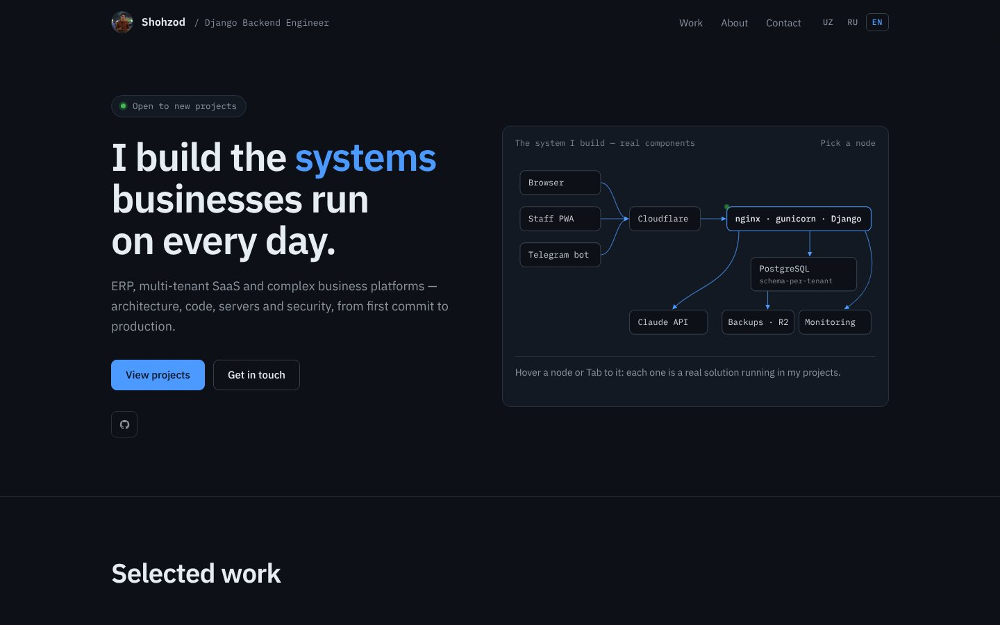
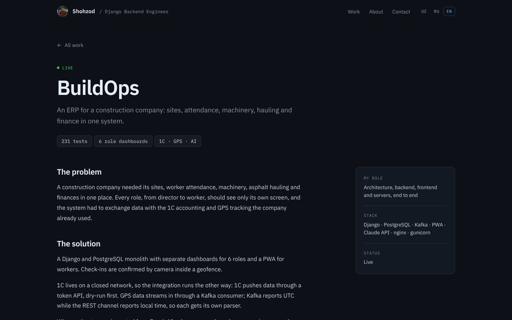

# Shohzod — Developer Portfolio

[](https://github.com/ShohzoDev0108/my-portfolio/actions/workflows/tests.yml)

Personal portfolio of a Django backend engineer, built with Django 5.2.
Server-rendered, trilingual (Uzbek / Russian / English) and fully usable
with JavaScript turned off.

[O'zbekcha qo'llanma → README.uz.md](README.uz.md)



## What's inside

- **Short home page, deep case studies.** Four sections (hero, selected
  work, about, contact). Each featured project gets its own page at
  `/<lang>/work/<slug>/` with the problem, solution, key engineering
  decisions and result. Those pages are the links I send to clients.
- **Interactive architecture diagram** in the hero, drawn as inline SVG.
  Hover or arrow-key through the nodes to see what each component does.
  The diagram is a single Tab stop with roving focus, and phones get a
  separate vertical drawing.
- **One URL per language** (`/uz/`, `/ru/`, `/en/`) with `hreflang`,
  canonical links, a sitemap covering every case page, and JSON-LD
  (`Person`, `CreativeWork`).
- **Everything editable in the admin:** owner name and About text
  (`SiteProfile`), projects with 3-language case-study fields, and social
  links. Social links without a URL stay hidden.
- **Contact form:**
  - works without JS, with an AJAX upgrade when JS is available;
  - honeypot plus per-IP and global hourly limits, counted in the
    database so they hold across gunicorn workers;
  - IPs are stored only as salted hashes;
  - optional Telegram notification.
- **Security:**
  - strict Content-Security-Policy (the one inline script is allowed by
    its SHA-256 hash) and a Permissions-Policy;
  - admin login throttling and a configurable admin path;
  - production hardening (HSTS, secure cookies, SSL redirect);
  - errors are logged to stderr.
- **Performance:**
  - self-hosted variable fonts (IBM Plex) with only the needed unicode
    subsets;
  - AVIF/WebP photos and WhiteNoise compressed, hashed static files;
  - uploaded project covers are re-encoded to 1600 px WebP with EXIF
    stripped.
  - Lighthouse (production mode): 99–100 performance and 100 for
    accessibility, best practices and SEO.



## Stack

Python · Django 5.2 · SQLite or PostgreSQL · WhiteNoise · Pillow · vanilla JS · hand-written CSS

## Run locally

```bash
python -m venv .venv
source .venv/bin/activate          # Windows: .venv\Scripts\activate
pip install -r requirements.txt
cp .env.example .env               # optional, defaults work for development
python manage.py migrate
python manage.py createsuperuser
python manage.py runserver
```

Open http://127.0.0.1:8000/. It redirects to `/uz/`, `/ru/` or `/en/`
based on a saved choice or the browser language. The admin is at `/admin/`,
or at whatever `DJANGO_ADMIN_URL` is set to.

## Tests

```bash
python manage.py test
```

The suite covers:

- routing and language detection;
- SEO output (hreflang, canonical, JSON-LD, sitemap);
- case pages and the content migrations;
- the contact form: validation, honeypot, rate limits and proxy-header
  spoofing;
- CSP and inline-script hash consistency;
- admin login throttling and cover image compression.

GitHub Actions runs it on every push.

## Configuration

All settings come from environment variables (`.env` in development). See
[`.env.example`](.env.example). The ones that matter in production:

| Variable | Purpose |
|---|---|
| `DJANGO_DEBUG=False`, `DJANGO_SECRET_KEY` | required; the site refuses to start with the dev key |
| `DJANGO_ALLOWED_HOSTS`, `DJANGO_CSRF_TRUSTED_ORIGINS` | your domain |
| `DJANGO_ADMIN_URL` | non-default admin path, e.g. `manage-7f3k/` |
| `SITE_CONTACT_EMAIL` | shown on the site; the e-mail block stays hidden until it is set |
| `CONTACT_TRUST_PROXY_HEADERS=True` | only behind nginx / PythonAnywhere, so the real client IP is used |
| `TELEGRAM_BOT_TOKEN`, `TELEGRAM_CHAT_ID` | optional contact-form notifications |

Deployment notes for PythonAnywhere and an nginx + gunicorn VPS are in
[README.uz.md](README.uz.md).

## License

Code: [MIT](LICENSE). Text content, photos and project descriptions are
© Shohzod, all rights reserved. Fonts are under the SIL Open Font
License; see `static/portfolio/fonts/`.
